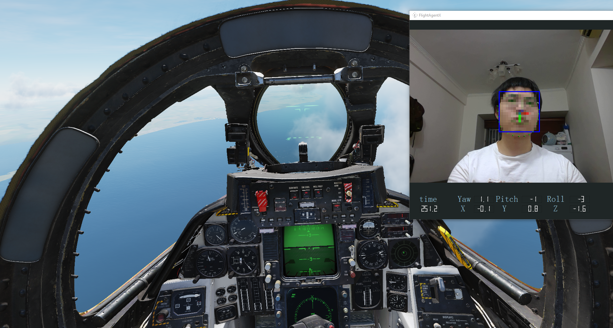

# Introduction

FlightAgentX is a facial head tracker for gaming usage. Perform as TrackIR or [Opentrack](https://github.com/opentrack/opentrack) (pointtracker) as track camera controller for Flight Simulation Games like DCS.

## Prerequst
A normal web camera.

[opentrack](https://github.com/opentrack/opentrack) is recommend to install now.
## Usage
This program is still under development, not stable yet. **I will never collect any user data from your camera.**

Download FlightAgentX at [Release](https://github.com/xuhao1/FlightAgentX/releases)

This program supports control games directly or uses Opentrack as backend. For now, the spline function is in development, so use Opentrack is a good idea. If you are using this program individually, please modify the config.yaml.

Just turn your opentrack input to UDP and open FlightAgentX.exe. Everything works fine.

Or using dcs.ini inside release folder.

Video can be found on https://www.bilibili.com/video/BV1rE411c7Wx/
## Future Plan (Maybe in a year)
1. Try to reinforce the robust of the tracker.
2. Will add a better pointtracker frontend.
3. Will add spline function.
4. Will fuse IMU with face tracker.

## LICENSE
MIT.

## Third-party Libraries
[OpenCV](https://opencv.org/)

[dlib](http://dlib.net/)

[UGlobalHotkey](https://github.com/falceeffect/UGlobalHotkey)

[yaml-cpp](https://github.com/jbeder/yaml-cpp)

[Eigen](http://eigen.tuxfamily.org/index.php?title=Main_Page)

## 介绍
这是一个基于面部识别的头瞄，用于模拟类游戏。和TrackIR或者[opentrack](https://github.com/opentrack/opentrack)（如国内流行的pointtracker）功能类似，但是只需要摄像头。

## 预先要求
一个正常的web摄像头。

请事先安装[opentrack](https://github.com/opentrack/opentrack)

## 使用
首先这玩意还没有成熟，问题很多。体验党慎用。**作者永远不会从你的摄像头里收集任何用户数据。**

在 [Release](https://github.com/xuhao1/FlightAgentX/releases) 下载FlightAgentX

你可以使用本程序直接控制游戏，或者使用opentrack作为后端。考虑到目前曲线功能还没有开发完成，使用opentrack作为后端是一个好主意。如果你想独立使用本程序，请修改config.yaml。

把你的opentrack的input设置为UDP，打开FlightAgentX.exe，然后一切都会工作的很美丽。

或者使用release中附带的 dcs.ini文件。

视频见b站 https://www.bilibili.com/video/BV1rE411c7Wx/

## 未来一年内的开发计划

1. 加强脸瞄的稳定性
2. 加入更好的pointtracker前端
3. 加入曲线编辑功能
4. 把IMU融合到脸瞄中

## 第三方库
[OpenCV](https://opencv.org/)

[dlib](http://dlib.net/)

[UGlobalHotkey](https://github.com/falceeffect/UGlobalHotkey)

[yaml-cpp](https://github.com/jbeder/yaml-cpp)

[Eigen](http://eigen.tuxfamily.org/index.php?title=Main_Page)

## 协议

MIT
