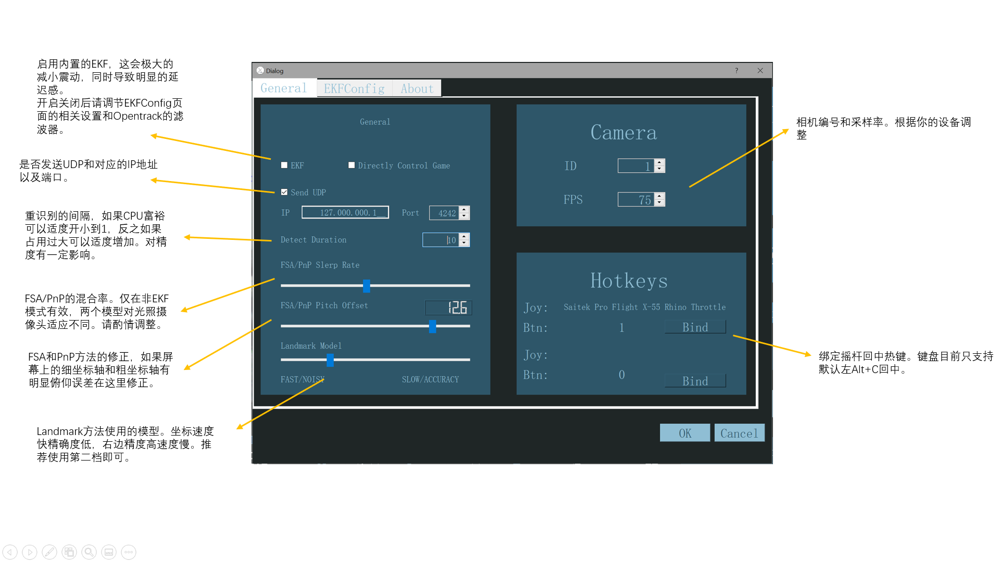

## 介绍
这是一个基于面部识别的头瞄，用于模拟类游戏。和TrackIR或者[opentrack](https://github.com/opentrack/opentrack)（如国内流行的pointtracker）功能类似，但是只需要摄像头。

## 预先要求
一个正常的web摄像头或笔记本内置摄像头，或者强烈推荐索尼的Cl eye摄像头（并且使用广角模式)，并且安装合适的驱动使得可以使用60fps/75fps，分辨率大于640x480即可使用，目前更多的分辨率也没有用。开源驱动可以使用[PS3EyeDirectShow](https://github.com/jkevin/PS3EyeDirectShow)。

尽管任何摄像头都可以工作，但是为了最好的稳定性，请使用高帧率摄像头，并且推荐放置于屏幕正上方，摄像头俯视对准用户。让镜头凝望着你。并且保证中立位置你的头处于屏幕中央。

请事先安装[opentrack](https://github.com/opentrack/opentrack)

## 使用
首先这玩意还没有成熟，问题很多。体验党慎用。**作者永远不会从你的摄像头里收集任何用户数据。**

在 [Release](https://github.com/xuhao1/FlightAgentX/releases) 下载FlightAgentX。注意由于作者的偷懒，解压缩时请务必不要使用中文路径，否则会无法运行。

你可以使用本程序直接控制游戏，或者使用opentrack作为后端。考虑到目前曲线功能还没有开发完成，推荐使用opentrack。

目前所有主要配置功能都在主页面下的Config页面中，一部分很少需要改动的可以在config.yaml中修改，请设置程序满足你的需求。

设置好config.yaml后，一般推荐结合opentrack使用（即关闭use_ft 和use_npclient）。

把你的opentrack的input设置为UDP，打开FlightAgentX.exe，然后即可运行对应的游戏。务必在Opentrack设置曲线和滤波以获得最好的游戏体验。
如果画面有抖动请拉大Filter的smooth。

或者这里的[dcs.ini](./docs/dcs.ini)文件。点击Opentrack的Profile，打开open configuration directory，把[dcs.ini](./docs/dcs.ini)拷进去，然后在右边选择dcs.ini。

回中请同时在FlightAgentX的配置页面和Opentrack的配置页面绑定到摇杆上。键盘视角回中FlightAgentX默认是左alc+c，无法修改，但是该键位会被dcs屏蔽。请隐藏dcs页面后使用.
注意对于战争雷霆等游戏，请先打开头瞄软件再打开游戏。

视频见b站 https://www.bilibili.com/video/BV1ey4y1C7Za