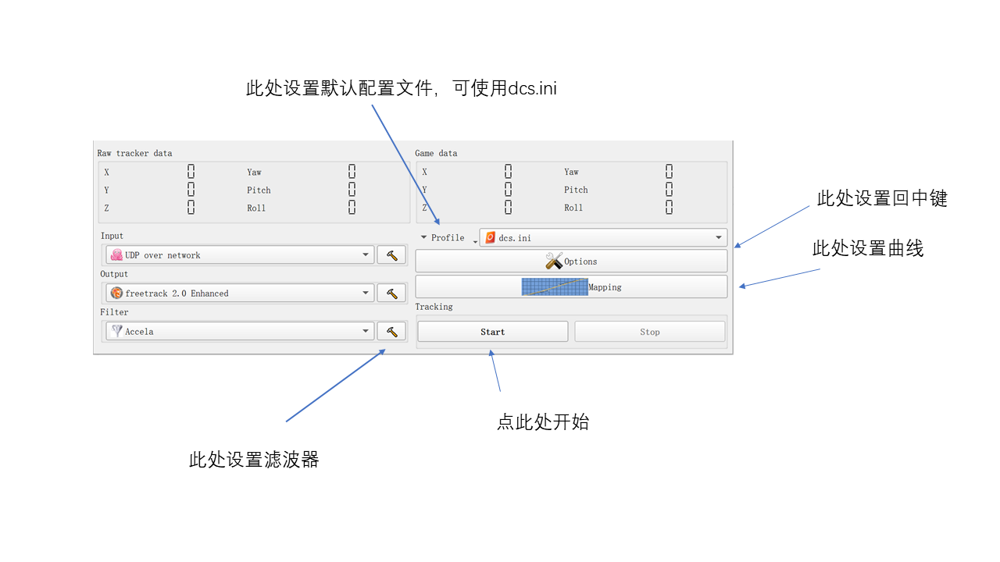
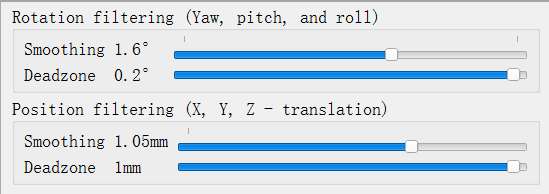

## 介绍
这是一个基于面部识别的头瞄，用于模拟类游戏。和TrackIR或者[opentrack](https://github.com/opentrack/opentrack)（如国内流行的pointtracker）功能类似，但是只需要摄像头。

## 预先要求
一个正常的web摄像头或笔记本内置摄像头，或者强烈推荐索尼的Cl eye摄像头（并且使用广角模式)，并且安装合适的驱动使得可以使用60fps/75fps，分辨率大于640x480即可使用，目前更多的分辨率也没有用。开源驱动可以使用[PS3EyeDirectShow](https://github.com/jkevin/PS3EyeDirectShow)。

尽管任何摄像头都可以工作，但是为了最好的稳定性，请使用高帧率摄像头，并且推荐放置于屏幕正上方，摄像头俯视对准用户。让镜头凝望着你。并且保证中立位置你的头处于屏幕中央。

请事先安装[opentrack](https://github.com/opentrack/opentrack)

## 使用
首先这玩意还没有成熟，问题很多。体验党慎用。**作者永远不会从你的摄像头里收集任何用户数据。**

在 [Release](https://github.com/xuhao1/FlightAgentX/releases) 下载FlightAgentX

你可以使用本程序直接控制游戏，或者使用opentrack作为后端。考虑到目前曲线功能还没有开发完成，推荐使用opentrack。

目前所有配置功能都在目录下的config.yaml中，请修改config.yaml以适配你的使用。

```
detect_duration: 10 #重复检测的帧数，如果屏幕上的蓝框跳动，可改低，最小为1，注意这个值越低cpu占用越高
camera_id: 0 #默认的camera id
enable_multithread_detect: true #多线程，如果false了就没法使用了
retrack_queue_size: 10 #如果你的电脑cpu很烂这个选项才有用。不过很烂建议换电脑，作者不对小霸王进行特殊优化。
fps: 75 #默认FPS，CL Eye 如果使用codelaboratories的付费驱动请设置为75，如果使用PS3EyeDirectShow设置为60，其他摄像头设置能达到的最高帧率，如果设置以后帧率仍然锁定为30说明不支持。
send_posedata_udp: true #是否发送udp，结合opentrack使用时设置为true
port: 4242 #默认端口
udp_host: "127.0.0.1" #IP,如果你在不同的电脑运行头瞄和opentrack，请改为对应的ip

use_ft: false #打开后直接使用FlightAgentX控制游戏的头部，但是目前不支持曲线映射
use_npclient: false #打开后直接使用FlightAgentX控制游戏的头部，但是目前不支持曲线映射

#EKF 参数，仅在ekf设置为true的情况下工作。目前推荐关闭。
use_ekf: false
cov_Q: 0.1 #姿态准确性 
cov_T: 0.05 #位移准确性
cov_V: 10.0 #速度稳定性
cov_W: 40.0 #角速度稳定性
ekf_predict_dt: 0.001 #EKF 每次预测的最小时间

disp_duration: 30 #预览图像刷新的帧率
disp_max_series_size: 1000 #EKF config界面显示的最多点数

detect_method: 0 #进行头部跟踪的方法，0为默认的脸部识别，1位尚在开发中二维码。

fsa_pnp_mixture_rate: 0.5 #用于调节非EKF模式下。FSA Net和PnP姿态估计结果混合的比例。当设置为0完全使用FSANet，设置为1完全使用PnP。当预览画面中的特征点和面部贴合明显较差时，将这个值改小直到抖动减小为止。
```

设置好config.yaml后，一般推荐结合opentrack使用（即关闭use_ft 和use_npclient）。

把你的opentrack的input设置为UDP，打开FlightAgentX.exe，然后即可运行对应的游戏。务必在Opentrack设置曲线和滤波以获得最好的游戏体验。
如果画面有抖动请拉大Filter的smooth。




或者这里的[dcs.ini](./docs/dcs.ini)文件。点击Opentrack的Profile，打开open configuration directory，把[dcs.ini](./docs/dcs.ini)拷进去，然后在右边选择dcs.ini。

视角回中FlightAgentX默认是左alc+c，但是该键位会被dcs屏蔽。请隐藏dcs页面后使用，opentrack还需要设置独立回中按键。请参阅Opentrack相关文档。

注意对于站在雷霆等游戏，请先打开头瞄软件再打开游戏。

视频见b站 https://www.bilibili.com/video/BV1ey4y1C7Za